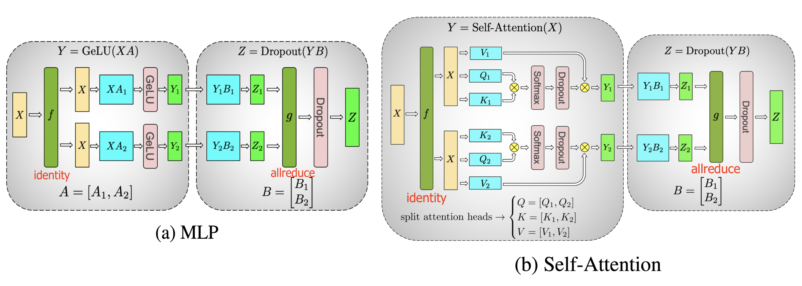
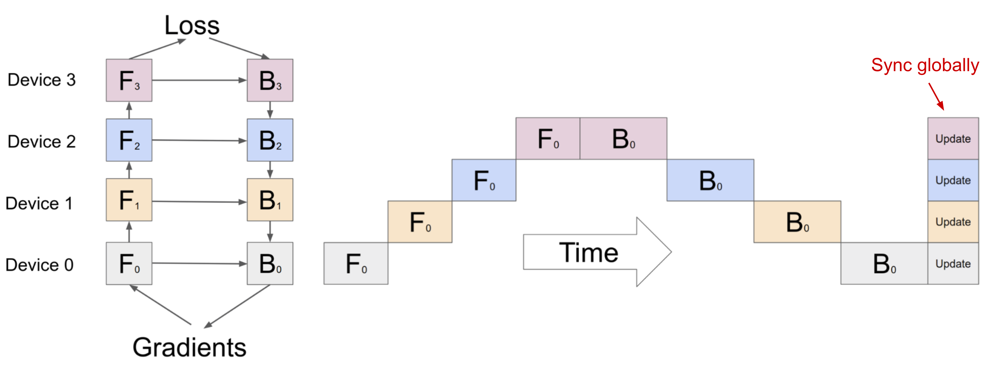

---
# 文章标题
title: 大规模AI模型的infer并行计算范式
# 设置写作时间
date: 2025-6-16
# 一个页面可以有多个分类
category:
  - SOSD
# 一个页面可以有多个标签
tag:
  - 分布式系统
  - MLSys
  - 并行运算
# 此页面会在文章列表置顶
sticky: true
# 此页面会出现在文章收藏中
star: true
# 侧边栏的顺序
# 数字越小越靠前，支持非整数和负数，比如 -10 < -9.5 < 3.2, order 为 -10 的文章会最靠上。
# 个人偏好将非干货或随想短文的 order 设置在 -0.01 到 -0.99，将干货类长文的 order 设置在 -1 到负无穷。每次新增文章都会在上一篇的基础上递减 order 值。
order: -2
---

## **Abstract**

随着models参数规模进入万亿级别，其在infer阶段的部署面临 `memery bound`、`compute bound`与`I/O bound`等多重挑战。本文旨在系统性地梳理和剖析大规模模型infer所采用的高性能并行计算范式。首先界定`DP` `PP` `TP`概念及其在推理场景下的应用边界与理论局限。其次，深入探讨了以`Continuous Batching`和`PagedAttention`为代表的现代推理系统的核心架构演进。在此基础上，本文进一步剖析了`Quantization`、`Speculative Decoding`等前沿算法优化。为将理论与实践相结合，本文选取了三个典型案例进行深度研究：面向特定架构的组件级并行（以Stable Diffusion为例）、应对超长上下文挑战的序列并行，以及在复杂单一样本场景下的混合并行策略（以AlphaFold3为例）。最后，通过一个在HPC环境下部署CPU推理集群的工程案例，展示了在现实约束下进行系统架构设计的智慧。本文期望为从事大规模AI infra的researcher和engineer提供一个清晰、全面的知识图谱与决策参考。

---

#### **Introduction**

1.  **infer成为新的瓶颈**
    *   后训练时代（Post-Training Era）的来临：模型即服务（Model-as-a-Service）的兴起
    *   推理阶段的三大核心挑战：
        *   **Memory Wall**：模型权重与动态KV缓存的巨大内存占用。
        *   **Compute Wall**：自回归解码带来的序列化计算与单次前向传播的巨大浮点运算量（FLOPs）。
        *   **Throughput Wall**：在满足严格Latency约束下，最大化并发处理能力的经济性问题。
2.  **constrution and contribution**
    *   系统性构建推理并行的class。
    *   深入分析关键系统优化与算法优化的内在机理。
    *   通过前沿案例研究，展示多维并行策略的综合应用。
    *   提供一个从理论到工程实践的完整审视视角。

#### **第一章：推理并行的基础范式与理论边界**

1.1. **张量并行 (Tensor Parallelism, TP): 降低计算延迟的核心手段**
> Megatron-LM: Training Multi-Billion Parameter Language Models Using Model Parallelism https://arxiv.org/abs/1909.08053.
> How to Train Really Large Models on Many GPUs? https://lilianweng.github.io/posts/2021-09-25-train-large/

*   **核心思想**：算子内部（Intra-Operator）的并行化，将单个计算密集型算子（如GEMM）切分至多个计算单元。
*   **数学原理**：基于矩阵乘法结合律的行、列切分策略。
    *   矩阵拆分：在神经网络层内部，将权重矩阵按行或列进行切分，分布到不同GPU上。（主要是Self-Attention层和MLP层）
    *   局部计算：每个GPU仅存储所分配的参数量，执行局部的矩阵乘法运算
    *   通信同步：
        *   列并行：通过 All-Gather 将不同GPU的输出部分进行拼接（如$[X W_{1},X W_{2}]$）
        *   行并行：通过 All-Reduce 对部分结果求和（如$X_{1}W_{1}+X_{2}W_{2}$​）

  

*   **应用与理论局限**：对节点内高带宽通信（如NVLink）有强依赖性；通信开销随并行度增加而上升，存在扩展性边界。

1.2. **模型并行 (Model Parallelism, MP): 低显存占用但并不高效**
    * **核心思想**：computation 和 model 参数在多台计算机上进行分区。与每个 worker 托管整个模型的完整副本的数据并行性不同，MP 仅在一个 worker 上分配一小部分模型参数，因此内存使用和计算量都减少了。
    * **主要缺陷**：通过具有顺序依赖关系的多个此类 worker 运行每个数据批次的都会导致微观上的串行。
    * **实现示意**：
 

1.3. **流水线并行 (Pipeline Parallelism, PP): 提升硬件利用率与吞吐量的关键**
    *   **核心思想**：算子间（Inter-Operator）的并行化，将模型的计算图（Computational Graph）按层（Stage）切分。
    *   **计算模型**：微批处理（Micro-batching）与流水线调度，分析“流水线气泡”（Pipeline Bubble）的成因与影响。
    *   **应用与理论局限**：无法降低单一样本的端到端延迟；负载均衡（Load Balancing）是关键挑战；气泡开销限制了其在小批量或低延迟场景下的效率。

1.4. **数据并行 (Data Parallelism, DP): 服务能力水平扩展的直接范式**
    *   **核心思想**：通过模型副本（Model Replication）实现请求级并行。
    *   **架构模式**：负载均衡器（Load Balancer） + 多个独立推理副本。
    *   **应用与理论局限**：无法解决单模型内存或计算瓶颈；成本随副本数线性增长；不适用于`batch_size=1`的场景。

#### **第二章：现代推理系统的核心技术与架构演进**

2.1. **架构范式：混合并行 (Hybrid Parallelism)**
    *   **设计哲学**：节点内TP + 节点间PP，最大化利用异构的通信带宽层级。
    *   **典型架构**：以Megatron-LM的部署架构为例，分析其通信模式。

2.2. **I/O与内存管理优化：从根本上提升系统效率**
    *   **调度革命：连续批处理 (Continuous Batching)**：将静态、离散的批处理，演进为动态、连续的请求流处理，从调度层面消除GPU空闲。
    *   **内存革命：分页注意力 (PagedAttention)**：借鉴操作系统虚拟内存思想，将逻辑上连续的KV缓存存储在物理上非连续的内存块（Block）中，从根本上解决内存碎片问题。

#### **第三章：前沿算法优化：突破性能瓶颈**

3.1. **模型压缩与量化 (Model Compression & Quantization)**
    *   **原理**：通过降低权重和/或激活值的数值精度，减少内存占用与计算量。
    *   **主流方法评述**：从GPTQ到AWQ，分析其如何在保持模型精度的前提下进行有效量化。

3.2. **解码加速：推测解码 (Speculative Decoding)**
    *   **原理**：利用轻量级草稿模型（Draft Model）与原始目标模型（Target Model）的验证机制，打破自回归解码“一次生成一个Token”的序列化限制。
    *   **性能模型分析**：分析其加速效果与草稿模型接受率（Acceptance Rate）之间的关系。

#### **第四章：特定领域并行策略剖析：案例研究 (Case Studies)**

4.1. **案例一：组件级与任务级并行——以Stable Diffusion为例**
    *   **问题域**：文生图模型的多阶段、异构计算特性。
    *   **解决方案**：构建“宏观流水线”（Macro-pipeline），将Text Encoder, U-Net, VAE Decoder等独立组件部署于不同硬件单元，实现组件级的流水线并行，最大化图像生成吞吐量。

4.2. **案例二：序列并行 (Sequence Parallelism)——应对超长上下文挑战**
    *   **问题域**：注意力机制中`O(N²)`的内存复杂度成为处理长序列的根本瓶颈。
    *   **解决方案**：沿序列维度对张量及计算进行切分，通过与张量并行协同的通信策略（如Reduce-Scatter, All-Gather），避免在单设备上实例化完整的注意力矩阵。

4.3. **案例三：复杂单一样本的混合并行——AlphaFold3的系统设计启示**
    *   **问题域**：`batch_size=1`的场景下，DDP失效，如何对单个“超级样本”进行并行计算？
    *   **多维度并行策略剖析**：
        *   **模型内部并行 (Intra-Model)**：TP（Head/Dimension并行）与PP是基础。
        *   **算法流程并行 (Inter-Task)**：利用DiT模块多次独立采样的特性，进行任务级并行（Task Parallelism）。
        *   **硬件内核级优化 (Kernel-Level)**：采用序列感知的算子调度策略，动态选择SDPA、FlashAttention或更前沿的SageAttention等最高效的注意力计算内核。

#### **第五章：工程实践的智慧：当理论框架遇到现实约束**

*   **案例背景**：在基于SLURM的纯CPU HPC集群上，规模化部署基于vLLM的DeepSeek模型。
*   **面临的约束**：vLLM的CPU后端功能受限（无TP/PP），且其分布式后端Ray与HPC生态不兼容。
*   **架构设计：服务层并行化与解耦编排**
    *   **核心思路**：构建一个由SGLang Router作为统一入口，SLURM作为资源调度与进程管理器的解耦式架构。
    *   **架构解析**：该架构在服务层实现了请求的负载均衡与并行处理，有效绕开了底层框架的限制。这是一个典型的“以系统架构设计弥补框架能力不足”的工程范例。
*   **单节点优化策略**：结合AWQ量化和投机解码，分别针对CPU环境下的内存带宽和单样本延迟瓶颈进行优化。

#### **结论与展望**

1.  **构建决策框架**：总结一张决策图或表格，为从业者在面对不同业务目标（延迟、吞吐量、成本）和技术挑战（模型大小、序列长度）时，如何选择与组合不同的并行及优化技术提供指导。
2.  **未来展望**：
    *   **自动化并行 (Automated Parallelism)**：自动并行策略搜索与编译优化。
    *   **软硬件协同设计 (Hardware-Software Co-design)**：面向未来AI硬件的算法与系统架构。
    *   **新计算范式**：探索非Transformer架构（如Mamba, RWKV）的并行潜力。