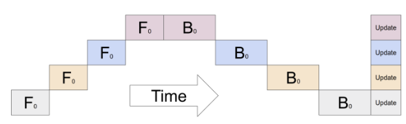
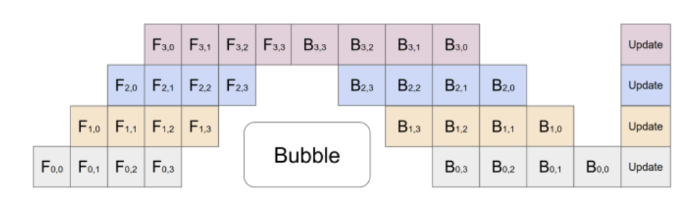

---
# 文章标题
title: 大规模AI模型的infer并行计算范式
# 设置写作时间
date: 2025-6-16
# 一个页面可以有多个分类
category:
  - SOSD
# 一个页面可以有多个标签
tag:
  - 分布式系统
  - MLSys
  - 并行运算
# 此页面会在文章列表置顶
sticky: true
# 此页面会出现在文章收藏中
star: true
# 侧边栏的顺序
# 数字越小越靠前，支持非整数和负数，比如 -10 < -9.5 < 3.2, order 为 -10 的文章会最靠上。
# 个人偏好将非干货或随想短文的 order 设置在 -0.01 到 -0.99，将干货类长文的 order 设置在 -1 到负无穷。每次新增文章都会在上一篇的基础上递减 order 值。
order: -2
---

### **摘要**

随着模型参数规模迈入万亿级别，其在推理（Inference）阶段的部署面临着内存墙（Memory Bound）、计算墙（Compute Bound）与I/O墙（I/O Bound）等多重挑战。本文系统性地梳理和剖析大规模模型推理所采用的高性能并行计算范式。文章首先对数据并行（Data Parallelism, DP）、流水线并行（Pipeline Parallelism, PP）和张量并行（Tensor Parallelism, TP）等基础概念进行界定，并探讨其在推理场景下的应用边界与理论局限。其次，深入探讨了以连续批处理（Continuous Batching）和分页注意力（PagedAttention）为代表的现代推理系统的核心架构演进。在此基础上，本文进一步剖析了模型量化（Quantization）与推测解码（Speculative Decoding）等前沿算法优化。为将理论与实践相结合，本文选取了三个典型案例进行深度研究：面向特定架构的组件级并行（以Stable Diffusion为例）、应对超长上下文挑战的序列并行，以及在复杂单一样本场景下的混合并行策略（以AlphaFold3为例）。最后，通过一个在HPC环境下部署CPU推理集群的工程案例，展示了如何在现实约束下进行系统架构设计。

---

### **引言**

1.  **推理成为新的瓶颈**
    *   **后训练时代（Post-Training Era）的来临**：随着模型即服务（Model-as-a-Service, MaaS）的兴起，推理取代训练，成为AI应用的主要成本中心和性能瓶颈。
    *   **推理阶段的三大核心挑战**：
        *   **内存墙 (Memory Wall)**：模型权重与动态KV缓存的巨大内存占用，常常超出单张加速卡的承载能力。
        *   **计算墙 (Compute Wall)**：自回归解码（Autoregressive Decoding）带来的序列化计算，以及单次前向传播巨大的浮点运算量（FLOPs），对计算单元构成严峻考验。
        *   **吞吐墙 (Throughput Wall)**：在满足严格延迟（Latency）约束下，如何最大化并发处理能力，是实现经济高效服务的关键。

---

### **第一章：推理并行的基础范式与理论边界**

#### **1.1 为何必须并行：当模型大到一张卡装不下**

在探讨如何并行之前，我们必须回答一个根本问题：为什么并行是必要的？答案很简单：**现代大语言模型已经大到任何单张市售的GPU都无法容纳。**

让我们用具体的例子来说明“内存墙”这一挑战：
*   **模型参数与内存占用**：模型参数通常以半精度浮点数（FP16）或BFloat16（BF16）格式存储，每个参数占用2个字节（Bytes）。
*   **案例一：Llama-2-70B**
    *   参数量：700亿（70 Billion）
    *   仅模型权重所需内存：$70 \times 10^9 \text{ params} \times 2 \text{ bytes/param} = 140 \text{ GB}$
*   **案例二：GPT-3 175B**
    *   参数量：1750亿（175 Billion）
    *   仅模型权重所需内存：$175 \times 10^9 \text{ params} \times 2 \text{ bytes/param} = 350 \text{ GB}$

目前最顶级的AI加速卡，如NVIDIA A100或H100，其最大显存也仅为80GB。显然，一个140GB甚至350GB的模型**根本无法被加载到任何一张单独的GPU中**。这还不包括推理过程中产生的动态KV缓存、激活值等额外开销。

**结论：当单个模型的体积超出单设备显存时，模型并行（Model Parallelism）不再是“可选项”，而是部署和运行模型的“唯一途径”。** 接下来的张量并行和流水线并行，正是为了解决这个核心问题而设计的。

#### **1.2 数据并行 (DP): 最简单的扩展范式，但无法解决根本问题**

*   **核心思想**：通过**模型副本（Model Replication）**实现请求级并行。每个工作单元（Worker，通常是一个GPU）都持有一个**完整**的模型副本，并将输入数据集切分为多个批次，并行处理不同的请求。
 
*   **架构模式**：一个负载均衡器（Load Balancer）将用户请求分发给多个独立的推理副本。
*   **意义与局限**：
    *   **意义**：数据并行是提升**服务吞吐量（Throughput）**最直接的方式。如果一个Llama-7B模型（约14GB）可以被单个A100 80GB显卡容纳，那么通过在8张A100上部署8个模型副本，理论上可以将服务的并发处理能力提升8倍。
    *   **理论局限：无法解决单模型瓶颈**。对于上述140GB的Llama-70B模型，由于单个GPU连一个完整的副本都装不下，数据并行从根本上无法适用。它只能水平扩展“能装得下”的模型，而不能解决“装不下”的问题。

#### **1.3 张量并行 (TP): 模型切分的核心手段，实现算子内并行**

张量并行直接解决了“模型太大装不下”的问题。它将模型内部的单个巨大算子（特别是矩阵乘法）“劈开”，分散到多个GPU上协同计算。

*   **核心思想**：算子内部（Intra-Operator）的并行化。它对节点内的高带宽通信（如NVLink）有强依赖性。

*   **数学原理**：基于矩阵乘法的结合律，对权重矩阵进行行或列切分。
    *   **列并行 (Column Parallelism)**：将权重矩阵A按列切分 $A = [A_1, A_2]$。输入X广播给所有设备，各设备独立计算 $XA_1$ 和 $XA_2$。最后，通过 **All-Gather** 通信将结果拼接为完整的输出。
    *   **行并行 (Row Parallelism)**：将权重矩阵A按行切分。输入X也相应地按列切分。各设备独立计算部分结果后，通过 **All-Reduce** 通信对部分结果求和，得到最终输出。
*   **应用实例：用2张80GB H100运行Llama-70B**
    *   **问题**：Llama-70B模型需要140GB显存。
    *   **解决方案**：采用2路张量并行（TP=2）。
        1.  **切分**：Transformer中的每一个线性层（Linear Layer）的权重矩阵都被切分为2份。例如，一个形状为 `(hidden_size, 4*hidden_size)` 的矩阵被切成两个 `(hidden_size, 2*hidden_size)` 的子矩阵。
        2.  **部署**：每个H100 GPU加载模型的一半权重，约70GB。
        3.  **计算**：当一个请求到来时，输入数据被送往两个GPU。在执行矩阵乘法时，每个GPU只完成自己那一半的计算。
        4.  **通信**：计算完成后，两个GPU通过高速的NVLink总线进行All-Reduce或All-Gather通信，将各自的部分结果合并成最终的完整结果，再送入下一层。
    *   **意义**：通过这种方式，TP成功将一个无法在单卡运行的巨大模型，部署到了多张卡上，**直接解决了内存墙问题**。同时，由于计算被分摊，它也能有效**降低单步计算的延迟**。
*   **理论局限**：通信开销随并行度增加而上升，存在扩展性边界。

#### **1.4 流水线并行 (PP): 另一种切分思路，按层切分构建流水线**

流水线并行提供了另一种切分模型的思路，它不切分算子，而是切分模型的层。

*   **核心思想**：算子间（Inter-Operator）的并行化。它将模型的计算图（Computational Graph）按**层（Layer）**进行垂直切分，不同阶段（Stage）部署在不同设备上，形成一条“计算流水线”。

*   **应用实例：用2张80GB H100运行Llama-70B**
    *   **问题**：Llama-70B有80个Transformer层，总大小140GB。
    *   **解决方案**：采用2路流水线并行（PP=2）。
        1.  **切分**：将模型从中间切开，例如，第1到40层部署在GPU 1上，第41到80层部署在GPU 2上。
        2.  **部署**：每个GPU加载模型的一半层，约70GB。
        3.  **计算**：输入数据首先在GPU 1上完成前40层的计算，其输出（称为激活值）被传递给GPU 2。GPU 2接收到激活值后，继续完成后40层的计算，得到最终结果。
*   **挑战与优化：流水线气泡 (Pipeline Bubble)**
    *   在上述朴素流程中，当GPU 1在计算时，GPU 2是空闲的；当GPU 2计算时，GPU 1也是空闲的，硬件利用率极低。
    *   **解决方案**：通过**微批处理（Micro-batching）**，将一个大批次（Batch）切分成多个小微批次（Micro-batch）。GPU 1处理完第一个微批次后立即传给GPU 2，并马上开始处理第二个微批次。这样，两个GPU的计算就可以重叠起来，形成真正的流水线，从而提升硬件利用率和整体吞吐。
*   **理论局限**：
    *   **流水线气泡**：即使优化后，在流水线的启动和排空阶段，依然存在部分设备空闲，产生“气泡”开销。气泡大小与流水线深度成正比，与微批次数量成反比。
    *   **延迟**：PP**无法降低单一样本的端到端延迟**，反而会因为跨设备通信而增加延迟。其优势在于提升吞吐。
    *   **负载均衡**：各阶段计算量和内存占用的均衡是实践中的关键挑战。

---

### **第二章：现代推理系统的核心技术与架构演进**

在基础并行范式之上，现代推理系统（如vLLM）通过更精细的调度和内存管理技术，将系统效率推向新高度。

*   **混合并行 (Hybrid Parallelism)**：实践中，通常将多种并行策略结合使用。典型的“3D并行”策略是：
    *   **节点内（Intra-Node）用TP**：利用高速NVLink，解决内存墙并降低延迟。
    *   **节点间（Inter-Node）用PP**：利用高速网络，扩展到更多节点。
    *   **整个集群用DP**：复制“TP+PP”组合体，最大化服务吞吐。

*   **调度与内存革命**：
    *   **连续批处理 (Continuous Batching)**：动态地管理请求批次，一个请求完成后立即返回并加入新请求，消除了传统静态批处理中的GPU空闲时间，大幅提升吞吐量。
    *   **分页注意力 (PagedAttention)**：借鉴操作系统中的“分页”思想，将KV缓存存储在非连续的内存块中，解决了内存碎片问题，使得系统能容纳更多并发请求，是vLLM等框架性能飞跃的核心。

---

### **第三章：算法优化**

算法层面的优化，从根本上减少了计算和内存的需求。

*   **模型压缩与量化 (Model Quantization)**：
    *   **原理**：通过降低权重和激活值的数值精度（如FP16 -> INT8/INT4），显著减少模型的内存占用和计算量。
    *   **关键方法**：AWQ (Activation-aware Weight Quantization)等方法通过识别并保护对模型性能影响大的“关键权重”，在量化时实现了极小的精度损失。

*   **解码加速：推测解码 (Speculative Decoding)**：
    *   **原理**：利用一个轻量级的“草稿模型”快速生成多个候选Token，再由原始大模型进行一次并行的验证。若草稿被接受，解码过程便“跳跃”了多步，从而实现加速，打破了自回归解码“一次一Token”的序列化瓶颈。

---

### **第四章：特定领域并行策略案例**

*   **案例一：Stable Diffusion的组件级并行**
    *   **问题**：文生图模型包含Text Encoder、U-Net、VAE等多个独立阶段。
    *   **方案**：构建“宏观流水线”，将不同组件部署在不同硬件上，实现任务级并行，最大化图像生成吞吐。

*   **案例二：长上下文的序列并行 (Sequence Parallelism)**
    *   **问题**：处理长序列时，注意力机制中与序列长度相关的激活内存成为瓶颈。
    *   **方案**：序列并行沿序列维度对张量进行切分，将巨大的激活内存分散到多个设备上，从而支持更长的上下文。

*   **案例三：AlphaFold3的复杂单一样本混合并行**
    *   **问题**：在batch_size=1的超大、复杂样本场景下，DP失效。
    *   **方案**：深度融合TP、PP，并结合算法流程中的任务级并行，甚至采用2D/2.5D张量并行，极致地分解单个样本的计算。

---

### **第五章：工程实践**

*   **案例背景**：在纯CPU的HPC集群上部署基于vLLM的DeepSeek模型。
*   **约束与挑战**：vLLM的CPU后端功能受限，且其分布式后端Ray与HPC的SLURM作业系统不兼容。
*   **架构设计：服务层并行与解耦**
    *   **核心思路**：放弃框架原生的分布式能力，在服务层实现并行。构建一个由统一负载均衡器（SGLang Router）和多个由SLURM管理的独立vLLM实例组成的解耦架构。
    *   **启示**：这是一个典型的“以系统架构设计弥补框架能力不足”的工程范例，展示了如何在现实约束下灵活运用并行思想。

### **附录**

#### **A.1 张量并行 (Tensor Parallelism, TP) 的数学原理**

张量并行（TP）的核心是将神经网络中计算密集的算子（主要是矩阵乘法）分解到多个设备上。其精髓在于利用矩阵乘法的线性代数性质，巧妙地设计计算与通信的顺序，以最小化开销。

##### **A.1.1 Transformer中MLP层的并行化**

一个标准的Transformer MLP层包含两个线性变换和一个非线性激活函数（如GeLU），其计算可以表示为：
$$ Y = \text{GeLU}(XA)B $$
其中，$X$是输入，$A$和$B$是权重矩阵。在Megatron-LM中，这一过程被分解为两次矩阵乘法，并应用了“列并行-行并行”的策略，以实现通信优化。假设我们有 $p$ 个GPU。

**1. 第一次矩阵乘法：列并行 (Column Parallelism)**

*   **权重切分**：将第一个权重矩阵 $A$ 按其**列**维度切分为 $p$ 块：
    $$ A = [A_1, A_2, \dots, A_p] $$
    其中，$A_i$ 是分配给第 $i$ 个GPU的子矩阵。
*   **计算流程**：输入 $X$ 被视为一个f操作（在前向传播中是广播/Identity，在反向传播中是All-Gather）。每个GPU都拥有完整的输入$X$，并独立计算其部分结果：
    $$ Z_i = X A_i $$
*   **本地激活**：由于GeLU是一个逐元素（element-wise）的操作，它可以直接在每个GPU上本地执行，而无需任何通信：
    $$ G_i = \text{GeLU}(Z_i) $$
    **关键洞察**：在此处进行非线性激活是通信优化的核心。如果先将$[Z_1, Z_2, \dots, Z_p]$通过All-Gather拼接起来再激活，将会引入一次代价高昂的通信。

**2. 第二次矩阵乘法：行并行 (Row Parallelism)**

*   **权重切分**：将第二个权重矩阵 $B$ 按其**行**维度切分为 $p$ 块：
    $$ B = \begin{pmatrix} B_1 \\ B_2 \\ \vdots \\ B_p \end{pmatrix} $$
*   **计算流程**：每个GPU $i$ 使用其本地的激活结果 $G_i$ 和权重分块 $B_i$ 计算部分输出：
    $$ Y_i = G_i B_i $$
*   **结果聚合**：最终的输出 $Y$ 是所有部分输出 $Y_i$ 的总和。这通过一次 **All-Reduce** 操作完成。这被视为一个g操作（在前向传播中是All-Reduce，在反向传播中是Identity）。
    $$ Y = \sum_{i=1}^{p} Y_i = \text{All-Reduce}(\{Y_1, Y_2, \dots, Y_p\}) $$

通过这种“列并行 -> 本地激活 -> 行并行”的流程，一个完整的MLP层只在最后需要一次All-Reduce通信，极大地提升了并行效率。

##### **A.1.2 多头注意力 (MHA) 层的并行化**

MHA层的并行化利用了注意力头（Attention Heads）之间天然的独立性。

*   **核心思想**：将总共$h$个注意力头均分到$p$个GPU上，每个GPU负责$h/p$个头的计算。
*   **权重切分**：Query, Key, Value的投影矩阵 $W^Q, W^K, W^V$ 均按其输出维度（列维度）进行切分，与MLP的第一层类似。每个GPU $i$ 持有其对应注意力头的权重分片 $W_i^Q, W_i^K, W_i^V$。
*   **并行计算**：
    1.  输入 $X$ 广播至所有GPU。
    2.  每个GPU $i$ 独立计算其分配到的注意力头的Q, K, V：
        $$ Q_i, K_i, V_i = XW_i^Q, XW_i^K, XW_i^V $$
    3.  每个GPU $i$ 独立计算其注意力输出：
        $$ \text{Head}_i = \text{Attention}(Q_i, K_i, V_i) = \text{Softmax}\left(\frac{Q_i K_i^T}{\sqrt{d_k}}\right)V_i $$
*   **结果聚合**：
    1.  所有GPU的注意力头输出 $\{\text{Head}_1, \dots, \text{Head}_p\}$ 在逻辑上需要被拼接（Concatenate）。
    2.  拼接后的结果再通过输出投影矩阵 $W^O$ 进行线性变换。
    3.  为了优化，这一过程也采用了与MLP层类似的行并行策略。$W^O$ 矩阵按行切分，每个GPU计算一个部分投影结果，最后通过一次 **All-Reduce** 将所有部分结果相加，得到最终的MHA层输出。

#### **A.2 序列并行 (Sequence Parallelism, SP)**

当序列长度 $s$ 变得极长时，即使经过TP切分，激活值（Activations）的内存占用（通常与 $s \times b \times h$ 成正比，$b$为批量大小，$h$为隐藏层维度）也会成为瓶颈。序列并行旨在解决此问题。

*   **核心思想**：在TP已将模型参数和计算在设备间切分的基础上，进一步将那些在TP中未被切分（即被复制）的张量，沿序列维度 $s$ 进行切分。
*   **作用域**：主要作用于LayerNorm、Dropout以及各种逐元素操作，因为这些操作在纯TP中需要在每个GPU上保留完整的激活副本。
*   **计算流程 (以LayerNorm为例)**：
    1.  **输入切分**：输入张量 $X$（形状为 $(s, b, h)）沿序列维度$s$被切分为$p$块，$X_i$（形状为 $(s/p, b, h)）被分发到第$i$个GPU。这是一个 **Scatter** 操作。
    2.  **局部统计**：每个GPU $i$ 在其本地数据 $X_i$ 上计算局部的均值 $\mu_i$ 和方差 $\sigma_i^2$。
    3.  **全局统计同步**：为了得到整个序列的准确均值$\mu$和方差$\sigma^2$，需要一次跨所有GPU的 **All-Reduce** 操作来聚合局部统计量。
    4.  **本地归一化**：每个GPU使用同步后的全局$\mu$和$\sigma^2$来归一化其本地数据块$X_i$。
    5.  **输出聚合**：为了让后续的TP层（如矩阵乘法）能正常工作，需要将沿序列维度切分的激活重新拼接成完整的张量。这通过一次 **All-Gather** 操作完成。

通过在TP通信的间隙插入沿序列维度的 Scatter 和 Gather 操作，SP将激活内存的占用降低了$p$倍，代价是增加了额外的通信开销。

#### **A.3 多维张量并行 (2D Tensor Parallelism)**

1D TP虽然有效，但其通信成本与并行度 $p$ 成正比，且激活内存并未完全切分。2D TP通过将设备组织成二维网格来进一步优化。

*   **核心思想**：将 $p$ 个GPU组织成一个 $p_r \times p_c$ 的二维网格，其中 $p = p_r \times p_c$。模型权重和激活张量同时沿两个维度进行切分。
*   **以矩阵乘法 $Y = XA$ 为例**：
    *   **数据布局**：
        *   输入激活 $X$ 沿其行维度（通常是batch/sequence维度）被切分为 $p_r$ 份，并分发给设备网格的**各行**。即，同一行内的所有GPU拥有相同的 $X$ 分片。
        *   权重矩阵 $A$ 沿其列维度被切分为 $p_c$ 份，并分发给设备网格的**各列**。即，同一列内的所有GPU拥有相同的 $A$ 分片。
        *   因此，位于网格坐标 $(i, j) 的GPU拥有数据 $X_i$ 和 $A_j$。
    *   **计算与通信流程**：
        1.  **第一步通信 (行内广播)**：在设备网格的**每一行**内，输入分片 $X_i$ 需要被广播给该行的所有GPU。经过此步，GPU $(i, j) 持有 $X_i$ 和 $A_j$。
        2.  **局部计算**：每个GPU $(i, j) 独立计算其局部乘积：
            $$ Y_{ij} = X_i A_j $$
        3.  **第二步通信 (列内归约)**：最终的结果 $Y$ 是所有局部结果 $Y_{ij}$ 在列维度上的拼接和行维度上的求和。为了得到最终输出 $Y_i$，需要在设备网格的**每一列**内进行一次 **Reduce-Scatter** 或 **All-Reduce** 操作，将同一列的所有 $Y_{ij}$ (固定j, 变化i) 的结果聚合起来。

*   **优势分析**：
    *   **显存**：与1D TP相比，激活内存和参数内存在2D TP中都被切分。单个GPU的激活内存占用减少为 $1/p_r$，参数内存占用减少为 $1/p_c$。
    *   **通信**：虽然需要两次通信，但每次通信只在较小的设备组（行或列）内进行，在某些网络拓扑下可以获得更优的通信效率。

#### **A.4 推测解码 (Speculative Decoding)**

推测解码通过“草稿-验证”机制来打破自回归解码的序列化瓶颈。

*   **参与者**：
    *   **目标模型 $M_t$**：原始的、强大的大模型。
    *   **草稿模型 $M_d$**：一个规模小得多、速度快得多的模型。

*   **详细流程**：
    1.  **起草阶段 (Drafting)**：给定当前已生成的序列（上下文）$x_{prefix}$，使用**草稿模型 $M_d$** 以自回归的方式快速生成一个包含 $k$ 个Token的草稿序列 $\gamma = (\tilde{x}_1, \tilde{x}_2, \dots, \tilde{x}_k)$。在此过程中，记录下草稿模型在每一步的输出概率分布 $P_d(\cdot | x_{prefix}, \tilde{x}_{1 \dots i-1})$。

    2.  **验证阶段 (Verification)**：将前缀和整个草稿序列拼接起来，形成一个新的输入 $[x_{prefix}, \gamma]$。将此输入**一次性**传入**目标模型 $M_t$** 进行前向计算。这会得到目标模型对于每个位置的预测概率分布 $P_t(\cdot | x_{prefix}, \tilde{x}_{1 \dots i-1})$。

    3.  **接受/拒绝决策 (Acceptance/Rejection)**：从草稿的第一个Token开始，逐个进行判断：
        *   对于第 $i$ 个草稿Token $\tilde{x}_i$：
            *   获取它在草稿模型和目标模型中的概率：$p_d = P_d(\tilde{x}_i | \dots)$ 和 $p_t = P_t(\tilde{x}_i | \dots)$。
            *   生成一个 $[0, 1]$ 之间的随机数 $r$。
            *   **接受条件**：如果 $r \le \min(1, \frac{p_t}{p_d})$，则接受 $\tilde{x}_i$，并继续验证下一个Token $\tilde{x}_{i+1}$。
            *   **拒绝条件**：如果 $r > \frac{p_t}{p_d}$，则拒绝 $\tilde{x}_i$ 以及其后的所有草稿Token。

    4.  **修正与补全 (Correction & Completion)**：
        *   **如果发生拒绝**：假设在第 $i$ 个位置发生了拒绝，那么已验证通过的序列是 $(\tilde{x}_1, \dots, \tilde{x}_{i-1})$。此时，需要从一个“修正后”的概率分布中采样一个新的Token来补上。该修正分布为：
            $$ P_{\text{corrected}}(x) \propto \max(0, P_t(x|\dots) - P_d(x|\dots)) $$
            从 $P_{\text{corrected}}$ 中采样一个Token $x_{new}$，本轮解码结束。最终生成的序列是 $(\tilde{x}_1, \dots, \tilde{x}_{i-1}, x_{new})$。
        *   **如果所有草稿都接受**：如果所有 $k$ 个草稿Token都被接受了，那么还需要从目标模型对最后一个位置的预测 $P_t(\cdot | x_{prefix}, \gamma)$ 中采样一个额外的Token $x_{k+1}$。本轮解码结束。

*   **性能增益来源**：核心收益在于用 $k$ 次廉价的草稿模型前向传播和一次昂贵的目标模型前向传播，替代了 $k+1$ 次昂贵的目标模型前向传播。只要接受率足够高，就能实现显著加速。

#### **A.5 流水线并行 (PP) 的调度与开销分析**

流水线并行的核心挑战在于最小化“流水线气泡”（Pipeline Bubble），即由于流水线启动和排空阶段的依赖关系，导致部分设备处于闲置状态的时间。

##### **A.5.1 流水线气泡的量化分析**

假设我们有：
*   $p$: 流水线阶段（Stages）的数量，等于并行的设备数。
*   $m$: 微批次（Micro-batches）的总数量。
*   $T_f$: 单个微批次在一个阶段上的前向传播时间。
*   $T_b$: 单个微批次在一个阶段上的反向传播时间。

在最朴素的调度（如GPipe的“刷新式”流水线）中，所有$m$个微批次完成前向传播后，才统一开始反向传播。

*   **总执行时间**：
    $$ T_{\text{total}} = (p+m-1)T_f + m T_b $$
    前$(p-1)T_f$是流水线“填满”的时间，$m T_f$是所有微批次在最后一个阶段完成前向的时间，$m T_b$是反向传播时间。

*   **有效计算时间**（所有设备都在忙碌的时间）：
    $$ T_{\text{useful}} = m \times p \times (T_f + T_b) \quad (\text{单个GPU视角}) $$
    $$ T_{\text{useful}} = m \times (T_f + T_b) \quad (\text{整个流水线视角}) $$

*   **气泡时间 (Bubble Time)**：
    $$ T_{\text{bubble}} = (p-1)(T_f + T_b) $$
    这个公式直观地显示了流水线的“启动延迟”和“排空延迟”的总和。

*   **流水线气泡占比 (Bubble Ratio)**：
    $$ \text{Ratio}_{\text{bubble}} = \frac{T_{\text{bubble}}}{T_{\text{total}}} = \frac{(p-1)(T_f + T_b)}{m(T_f + T_b) + (p-1)T_f} $$
    当$T_f \approx T_b$时，公式简化为：
    $$ \text{Ratio}_{\text{bubble}} \approx \frac{2(p-1)}{2m + p-1} $$
    当微批次数量$m$远大于阶段数$p$时（$m \gg p$），该比例近似为：
    $$ \text{Ratio}_{\text{bubble}} \approx \frac{p-1}{m} $$
    **结论**：气泡开销与阶段数$p$成正比，与微批次数量$m$成反比。这是优化流水线效率的根本出发点。

##### **A.5.2 交错式流水线调度 (Interleaved Scheduling)**

为了减小气泡，Megatron-LM提出了交错式1F1B（1 Forward, 1 Backward）调度策略。它将$m$个微批次划分为更小的块，并尽早开始反向传播，从而让前向和反向计算重叠。

**执行流程**：一个阶段在完成某个微批次的前向计算后，不是立即开始下一个微批次的前向，而是优先执行已就绪的反向计算任务。这使得计算流水更加紧密，显著减少了GPU的空闲时间。通过这种方式，气泡大小可以被有效减小，但代价是需要缓存更多的激活值，因为前向和反向传播的间隔变长了。

---

#### **A.6 序列并行 (SP) 中LayerNorm的分布式计算**

序列并行将沿序列维度$(s, b, h)$的张量切分为$p$份，每个GPU持有$(s/p, b, h)的子张量。挑战在于，LayerNorm需要计算整个序列维度的均值和方差。

**1. LayerNorm的原始公式**:
对于输入张量$X$中的每一个特征向量$x$，LayerNorm计算如下：
$$ y = \frac{x - \mathbb{E}[x]}{\sqrt{\text{Var}[x] + \epsilon}} \cdot \gamma + \beta $$
其中$\mathbb{E}[x]和$\text{Var}[x]是在特征维度上计算的。但在SP中，我们需要在**序列和特征两个维度**上进行归一化。

**2. 分布式均值和方差的计算**:
假设第$i$个GPU持有数据块$X_i$，其元素数量为$N_i$。

*   **均值计算 $\mu$**:
    1.  每个GPU $i$ 计算其**局部元素总和** $\sum X_i$。
    2.  使用 **All-Reduce** 操作将所有GPU的局部总和相加，得到全局总和 $\sum X = \sum_{i=1}^{p} (\sum X_i)$。
    3.  全局均值为 $\mu = \frac{\sum X}{N}$，其中 $N = \sum N_i$是总元素数量。

*   **方差计算 $\sigma^2$**:
    方差的标准公式是 $\sigma^2 = \mathbb{E}[X^2] - (\mathbb{E}[X])^2$。
    1.  每个GPU $i$ 计算其**局部平方和** $\sum X_i^2$。
    2.  使用 **All-Reduce** 操作将所有GPU的局部平方和相加，得到全局平方和 $\sum X^2 = \sum_{i=1}^{p} (\sum X_i^2)$。
    3.  计算全局平方的均值 $\mathbb{E}[X^2] = \frac{\sum X^2}{N}$。
    4.  全局方差为 $\sigma^2 = \mathbb{E}[X^2] - \mu^2$。

**3. SP中的完整通信流程**:
*   $f_{SP}$ **(Scatter)**: 输入$X$沿序列维度被分散到各个GPU。
*   **局部计算**: 计算局部的$\sum X_i$和$\sum X_i^2$。
*   **All-Reduce**: 同步全局的$\sum X$和$\sum X^2$。
*   **本地归一化**: 每个GPU使用全局的$\mu$和$\sigma^2$来归一化其本地数据块$X_i$。
*   $g_{SP}$ **(All-Gather)**: 将归一化后的数据块$Y_i$重新拼接成完整的输出张量$Y$，以供后续层使用。

通过这两次通信（All-Reduce和All-Gather），序列并行以增加通信量为代价，成功地将巨大的激活内存分散到了多个设备上。

---

#### **A.7 激活感知权重化 (AWQ) 的核心原理**

AWQ (Activation-aware Weight Quantization) 的核心洞察是：**量化误差的显著性，不仅取决于权重本身，更取决于与之相乘的激活值的大小。**

**1. 问题定义**:
对于一个线性层 $Y=WX$，量化后的计算为 $Y_q = \text{quant}(W)X$。朴素量化（如round-to-nearest）的目标是最小化 $\| W - \text{quant}(W) \|$。但这忽略了输入$X$的影响。AWQ认为，我们应该最小化最终输出的误差，即 $\| WX - \text{quant}(W)X \|$。

**2. 激活感知的重要性**:
AWQ发现，模型中只有一小部分（约0.1%到1%）的权重对模型性能至关重要。这些权重并非其绝对值大，而是因为它们对应的输入通道（activation channel）的数值幅度始终很大。对于这些“显著”的通道，任何微小的权重误差都会被巨大的激活值放大，从而导致显著的性能下降。

**3. 尺度等效变换 (Scale-Equivalent Transformation)**:
为了保护这些重要权重，AWQ引入了一个尺度因子$s$。它将变换等效地应用于激活和权重：
$$ Y = WX = (W s^{-1}) (s X) = W' X' $$
这里的$s$是一个对角矩阵，对$X$的每个输入通道进行缩放。量化的目标变成了最小化：
$$ \| W'X' - \text{quant}(W')X' \|_F^2 $$
其中$\|\cdot\|_F$是Frobenius范数。

**4. 最佳尺度因子$s$的求解**:
AWQ的目标是找到一个最佳的$s$，使得$W' = Ws^{-1}$在量化时损失最小。这意味着我们希望$W'的数值范围更小、更适合量化。
AWQ提出，最佳的尺度因子$s_j$（对于第$j$个输入通道）应该与该通道激活值的幅度成正比。通过分析，他们给出了一个启发式的最佳尺度因子计算公式：
$$ s_j^* = \left( \max_i |X_{ij}| \right)^{\alpha} \quad \text{或更优地} \quad s_j^* = \left( \frac{1}{T} \sum_{t=1}^T |X_{ij}^{(t)}|^2 \right)^{1/4} $$
其中，$X_{ij}是输入张量$X$的第$i$个token在第$j$个通道的值，$\alpha$是一个超参数（通常取0.5）。更鲁棒的做法是使用校准数据集（calibration data）计算激活的二阶矩（或近似为L2范数），然后取其四次方根。

**5. 算法流程总结**:
1.  **分析阶段**: 使用一小部分校准数据对模型进行前向传播，记录每个线性层输入激活$X$的统计量（如每个通道的最大绝对值或L2范数）。
2.  **确定重要权重**: 根据激活的统计量，识别出那些持续接收到高幅度激活值的权重通道。
3.  **计算尺度因子**: 对每个通道$j$，根据其激活统计量计算出最佳尺度因子$s_j$。
4.  **应用尺度并量化**:
    *   对权重矩阵$W$的每一列$j$（对应输入通道$j$），除以$s_j$得到$W'_j = W_j / s_j$。
    *   对缩放后的$W'$进行量化，得到$\text{quant}(W')$。
5.  **推理阶段**:
    *   对于输入$X$，其每个通道$j$乘以对应的$s_j$，得到$X'$。
    *   执行矩阵乘法 $\text{quant}(W') X'$。

通过这种方式，AWQ将量化的“难度”从权重转移到了激活上。由于激活的缩放是无损的浮点运算，而权重在缩放后其动态范围被压缩，因此量化误差大大减小，从而在极低的位宽下（如INT4/INT3）也能保持很高的模型精度。